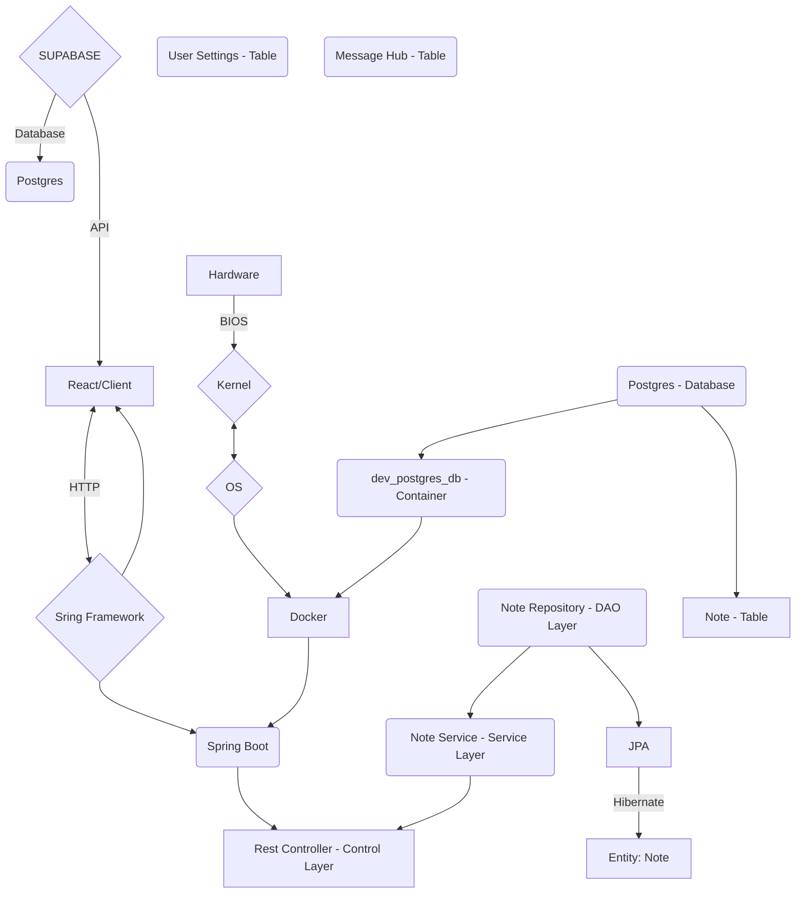

# REACT / SPRING BOOT

This course will introduce you to being a Full-stack developer using React and Spring Boot. Learning to use multiple 
frameworks, languages, and libraries together can be challenging, but it is also a great way to gain in-depth knowledge 
of a particular area of software development. If you’re looking to learn React, Spring Boot, TypeScript, and Kotlin all 
together, this comprehensive course is the perfect place to start. With detailed explanations, step-by-step 
instructions, and plenty of examples, this course will take you from the basics of each framework, language and library
to creating complex, feature-rich web and mobile applications. By the end of this course, you’ll have a solid 
understanding of the fundamentals of React, Spring Boot, TypeScript, and Kotlin, and be able to apply them in your own 
projects.  Let’s step into it!

# Course Outline

This course will be split into series, each series will have a separate branch in the GitHub repository.
1. [x] Series 1:  Kotlin / Spring Boot - setting up a Rest Controller and JPA Entity with test.
2. [x] Series 2: Setup your TypeScript React App and connect it to your Spring Boot Application
3. [x] Series 3: Using MUI and the Grid System, designing Layout and Theme
4. [x] Series 4: Connecting to Supabase and adding a Message Hub

## Application Diagram

## Required programs
1. Docker - https://www.docker.com/products/docker-desktop/
2. Install Git - https://git-scm.com/download/
3. IntelliJ - https://www.jetbrains.com/idea/download/ (Ultimate Edition was used in the video with Beta UI)

## Author
Author: [Joshua Matos]